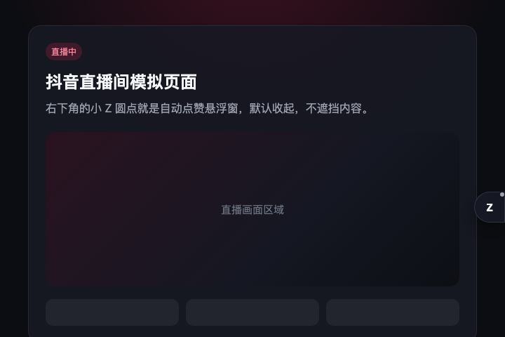
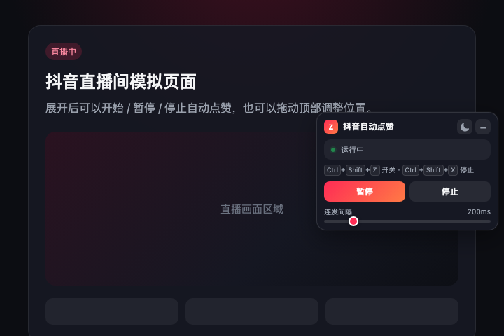
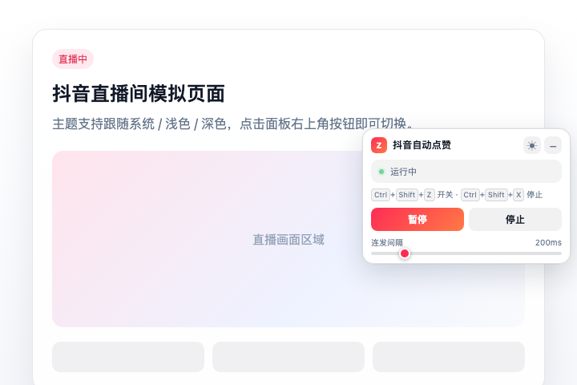
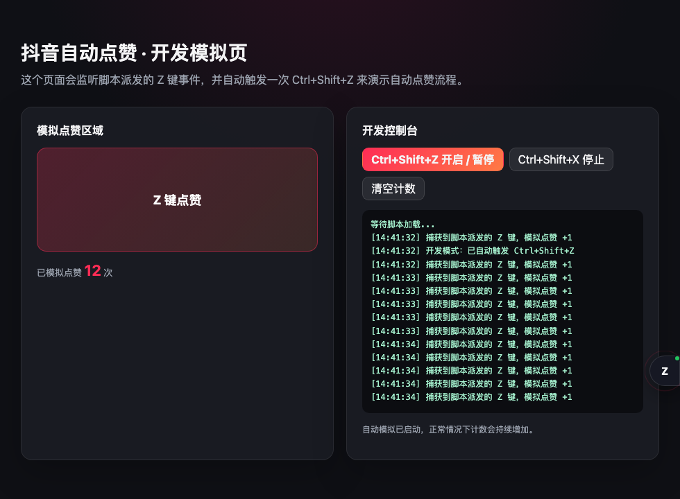

# 抖音自动点赞（Z 键连发）

一个可直接安装到 Tampermonkey / Greasemonkey 的 Userscript，通过模拟按下 `Z` 键实现自动点赞。项目已做工程化拆分，源码在 `src/`，`pnpm run build` 会生成最终可直接导入油猴的 `index.js`。

> 已修复上一版悬浮控件不可见的问题：原因是 Shadow DOM 里的 `:host { all: initial !important }` 覆盖了宿主元素的定位和尺寸，导致面板没有正常固定显示。现在控件会稳定显示在浏览器右下角。

## 功能特性

- **默认收起**：加载后是右下角的小 `Z` 圆点，不遮挡页面。
- **展开 / 收起**：点击圆点展开控制面板，点击面板右上角 `−` 收起。
- **拖拽**：展开后按住面板顶部可拖动；收起状态下也可以拖动小圆点。
- **贴边吸附**：松手后自动贴回最近的左 / 右侧边缘，贴边一侧为直角，另外两侧保持圆角。
- **自动收起**：展开后 6 秒无操作，或页面切换到后台时，会自动贴边收起。
- **主题切换**：支持跟随系统 / 浅色 / 深色三种模式，点击面板右上角主题按钮循环切换，选择会保存在本地。
- **快捷控制**：
  - `Ctrl + Shift + Z`：开启 / 暂停。
  - `Ctrl + Shift + X`：停止。
- **状态与速度**：面板显示待命 / 运行中 / 已暂停 / 已停止，可调间隔 50ms - 1000ms。
- **开发模拟**：`pnpm run dev` 提供本地模拟页，自动触发脚本并统计模拟点赞次数。

## 界面预览

| 收起状态 | 展开状态（深色） | 展开状态（浅色） |
| --- | --- | --- |
|  |  |  |

开发模拟页：



## 直接使用

1. 安装 [Tampermonkey](https://www.tampermonkey.net/) 或 Greasemonkey。
2. 新建一个 Userscript。
3. 把项目根目录下 `index.js` 的全部内容复制粘贴进去；也可以直接使用 `release/douyin-auto-like.user.js`。
4. 保存后打开抖音页面，右下角会出现 `Z` 小圆点。
5. 点击圆点展开面板，点击 **开始**。
6. 如果需要完整包，可下载 `release/douyin-auto-like-v2.3.0.zip`。

> `index.js` 是构建产物，不要直接修改；请改 `src/` 下的源码后执行 `pnpm run build`。

## 一键导入 Tampermonkey

项目内置了一个本地安装服务，会重新构建脚本，并自动打开 Tampermonkey 安装确认页：

```bash
pnpm run userscript:install
```

执行流程：

1. 重新构建最新的 `index.js`。
2. 启动本地 HTTP 服务，提供 `douyin-auto-like.user.js`。
3. 自动打开默认浏览器并访问安装地址。
4. Tampermonkey 弹出安装页面后，点击“安装”即可导入。

可用参数：

```bash
pnpm run userscript:install -- --no-open   # 只启动服务，不打开浏览器
pnpm run userscript:install -- --keep      # 保持服务运行
pnpm run userscript:install -- --port 4180 # 指定本地端口
```

> 受浏览器安全限制，脚本只能自动打开安装确认页，最终仍需在 Tampermonkey 中点击一次“安装”。

## 开发环境

### 环境要求

- Node.js >= 18
- pnpm >= 8

### 安装

```bash
pnpm install
```

项目目前没有运行时依赖，`pnpm install` 主要用于生成/更新 lockfile。

### 启动开发模拟页

```bash
pnpm run dev
```

默认地址：

```text
http://127.0.0.1:4173/
```

如果希望启动后自动打开浏览器：

```bash
pnpm run dev:open
```

开发页会：

- 加载 `src/` 源码构建出来的临时脚本；
- 监听脚本派发的 `Z` 键事件，统计模拟点赞次数；
- 自动触发一次 `Ctrl+Shift+Z`，让你无需手动操作就能看到自动点赞过程；
- 源码变化后通过 SSE 自动刷新页面。

如果不想自动模拟，可以访问：

```text
http://127.0.0.1:4173/?auto=0
```

也可以指定端口：

```bash
pnpm run dev -- --port 4174
```

### 构建

生成最终的油猴脚本：

```bash
pnpm run build
```

构建完成后会覆盖根目录的 `index.js`。

监听源码变化并自动重新构建：

```bash
pnpm run build:watch
```

检查构建产物语法：

```bash
pnpm run check
```

构建并生成应用包：

```bash
pnpm run package
```

会先重新构建 `index.js`，然后生成：

```text
release/
├── douyin-auto-like.user.js
└── douyin-auto-like-v2.3.0.zip
```

其中 `.user.js` 可以直接拖进 Tampermonkey，`.zip` 是包含用户脚本、README 和截图的完整包。

## 项目结构

```text
.
├── dev/
│   └── index.html                 # 开发模拟页
├── docs/
│   └── images/                    # README 截图
├── release/                       # pnpm run package 生成的应用包
├── scripts/
│   ├── build.mjs                  # pnpm run build / build:watch
│   ├── dev.mjs                    # pnpm run dev
│   ├── import-userscript.mjs      # pnpm run userscript:install
│   ├── package.mjs                # pnpm run package
│   └── lib/
│       └── bundler.mjs            # 轻量源码打包器
├── src/
│   ├── userscript.meta.txt        # 油猴脚本头
│   ├── userscript.config.json     # 匹配域名配置（默认 https://www.douyin.com/*）
│   ├── config.js                  # 配置与工具函数
│   ├── auto-like-controller.js    # 自动点赞业务逻辑
│   ├── floating-widget.js         # 悬浮窗 UI（拖拽、展开/收起、自动贴边、主题）
│   ├── bootstrap.js               # 启动、快捷键、初始化
│   └── main.js                    # 入口
├── index.js                       # 构建产物，直接导入油猴
├── package.json
└── README.md
```

构建脚本是一个无第三方依赖的轻量打包器：它会按 `src/main.js` 的依赖顺序合并模块，去掉 `import` / `export`，最后包进一个 IIFE 中。因此不需要安装 esbuild、rollup 等依赖，`pnpm run build` 可以直接运行。

## 自定义配置

修改 `src/config.js` 中的 `CONFIG`：

```js
export const CONFIG = {
    defaultInterval: 200,     // 默认连发间隔，单位毫秒
    minInterval: 50,          // 面板可调的最小间隔
    maxInterval: 1000,        // 面板可调的最大间隔
    intervalStep: 50,         // 每次调整的步长
    autoCollapseDelay: 6000,  // 无操作后自动收起的延时，单位毫秒
    viewportGap: 8,           // 自由拖动时距离浏览器边缘的间距（吸附时自动贴边）
    dragThreshold: 4,         // 拖动判定阈值
    panelWidth: 260,          // 展开面板宽度
    handleSize: 44,           // 收起圆点尺寸
    themeStorageKey: 'douyin-auto-like:theme', // 主题偏好存储键
};
```

修改后执行：

```bash
pnpm run build
```

## 使用说明

1. 点击右下角 `Z` 圆点展开面板。
2. 点击 **开始**，脚本会立即触发一次 `Z`，之后按设定间隔连续触发。
3. 点击 **暂停** 可临时停止；点击 **继续** 恢复。
4. 点击 **停止** 会停止连发，状态变为“已停止”。
5. 按住面板顶部可以移动面板；收起状态下也可以拖动小圆点，松手后会贴回最近的一侧边缘。
6. 点击面板右上角主题按钮，可在“跟随系统 → 浅色 → 深色”之间循环切换。
7. 不操作 6 秒后，面板会自动收起到当前最近的一侧边缘。

| 操作 | 快捷键 |
| --- | --- |
| 开启 / 暂停 | `Ctrl + Shift + Z` |
| 停止 | `Ctrl + Shift + X` |

> 当焦点在输入框、文本域或可编辑区域时，快捷键不会触发，避免影响正常输入。可以先点击页面空白处或直接使用悬浮窗按钮。

## 注意事项

- 脚本通过派发标准 `KeyboardEvent` 模拟按键，部分网站可能会检测 `event.isTrusted` 或自行实现按键逻辑，这种情况下脚本可能无法生效。
- 默认匹配域名是：

  ```text
  https://www.douyin.com/*
  ```

  可以在 `src/userscript.config.json` 中自定义，支持多个 `@match`：

  ```json
  {
    "matchPatterns": [
      "https://www.douyin.com/*",
      "https://live.douyin.com/*"
    ]
  }
  ```

  修改后执行 `pnpm run build` 或 `pnpm run package`，脚本头会自动生成多个 `@match`。
- 自动点赞属于自动化操作，可能违反部分平台的使用条款，存在账号被限制或封禁的风险。请自行判断并在合规场景下使用。
- 本项目仅用于学习和自动化测试场景，使用者需自行承担相应风险。

## 兼容性

- Chrome / Edge / Firefox 等支持 Tampermonkey 或 Greasemonkey 的现代浏览器。
- 依赖 `requestAnimationFrame`、`PointerEvent`、`Shadow DOM` 等现代浏览器 API。
